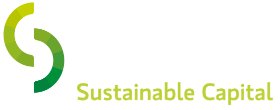

::: {.hero-banner style="text-align: center; padding: 2.5rem 0;"}
{width=260px alt="CAPSUS Logo"}

### Innovation for Sustainable Cities & Climate Action

CAPSUS is a mission-oriented consulting firm specialized in sustainability, energy, environmental management, and urban planning. Since 2009, we help design and manage solutions that foresee a better future for coming generations.

::: {style="margin-top: 2rem; display: flex; gap: 1rem; justify-content: center; flex-wrap: wrap;"}
[Explore Projects](portfolio-en.qmd){.btn .btn-primary role="button"}
[Our Expertise](expertise-en.qmd){.btn .btn-outline-primary role="button"}
[Join our Team](careers-en.qmd){.btn .btn-outline-secondary role="button"}
:::
:::

---

::: {layout-ncol=3 style="margin-top: 2rem;"}
::: {}
### Sustainable Urban Planning
Solutions for cities and buildings to reduce costs, enhance resilience, and improve environmental performance.
:::

::: {}
### Climate & Environmental Studies
Rigorous analytical modeling, environmental impact evaluations, and strategic investment roadmaps.
:::

::: {}
### Public Policies & Capacity
Policy design, emissions reduction planning, and interactive stakeholder capacity-building workshops.
:::
:::
